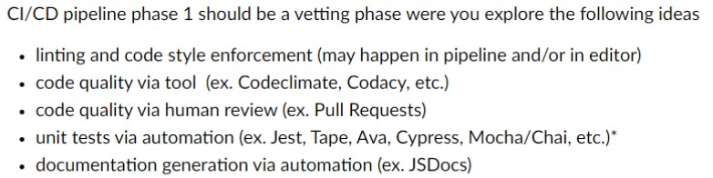

# Byte Brokers Weekly Meeting
### Setting:
> 5/21/2023 2:00pm, Zoom

### Type:
Weekly Meeting + program feature discussion

## Attendance:
- Arjun 
- Nikan
- Ryan
- Jennifer
- Jiapei
- Xin
- Jiaxin
- Chris
- Jinshi
## Team Progress:
- Updated on progress
- Merged individual feature branches to prod - successfully merged so now everything is synced
- Delegated tasks to finish phase 1 of CI pipeline task
## Agenda:
- Review task list + go over progress
- Discuss CI/CD implementation - Due tonight!!
# Discussion Notes:
Progress updates:
- Arjun & Ryan: Finished ADR and workflow for linting software - using 
- Jessica, Chris, Eric: Completed basic JS for questionnaire page, finished ADR for code - quality verification - chose code climate as the service, still working to integrate it into github actions
- Jennifer, Nikan, Bill: Worked on JS for horoscope display page - created basic JS for gathering input and displaying horoscope from JSON file based on the input received, waiting on implementation from form page to be integrated in order to finalize JS. Finished ADR for JS unit testing - chose JEST framework, wrote basic unit test to test workflow functionality and for CI pipeline
- Peter & Vicky: Finished barebones HTML and CSS for horoscope display page, finished ADR on automated documentation - chose JSDocs, still need to start implementing JSDocs in our code. 

### CI/CD pipeline phase 1 necessities: DUE TONIGHT(5/21)

- Ryan did demo on how to push and pull to update prod and feature branches
- Did same with other feature branches to make sure prod is up to date with all current feature branches - has integrated all 3 branches
- Made sure that prod doesn’t have any conflict - everything is clean
- Established proper process for CI pipeline with prod as our live page
- Interface-doc team implements code climate into CI pipeline - should be short
- Created simple outline for how code climate should be run as github action
### Delegation for finishing CI phase 1 tasks
- Jennifer and Ryan delegated to finish video
- Arjun and Ryan finish writeup for phase1.md

We need to finish horoscope module before we start tarot cards - as agreed on during brainstorming - so need to expedite the timeline

Finish all functionality and decorations by next friday, unit testing by sunday
Start tarot cards after?

## Action Items:
- Add in Code Climate action
- Finish md file that describes what has been completed/will be completed for pipeline
- Create video of current state of pipeline

## Next Meeting Time:
Sunday 5/28 @ 2:00pm, Zoom

### End Time: 
3:05 pm

