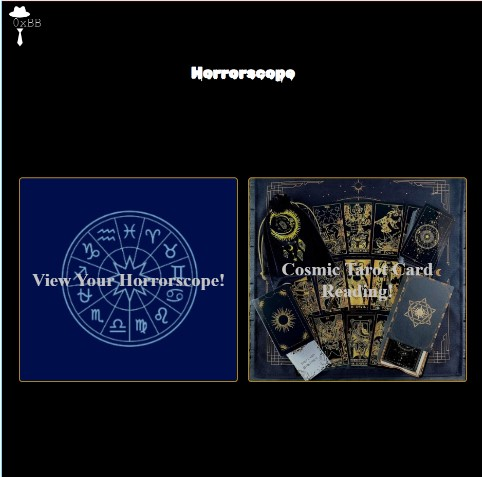
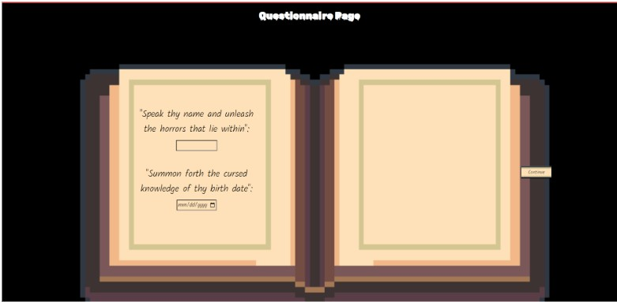
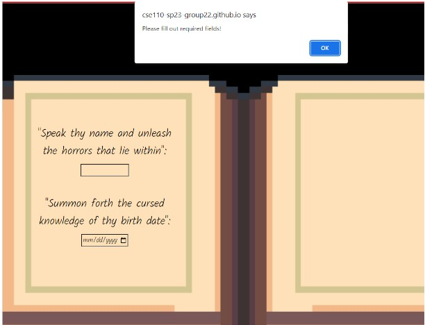
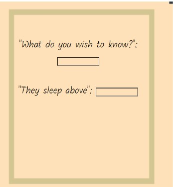
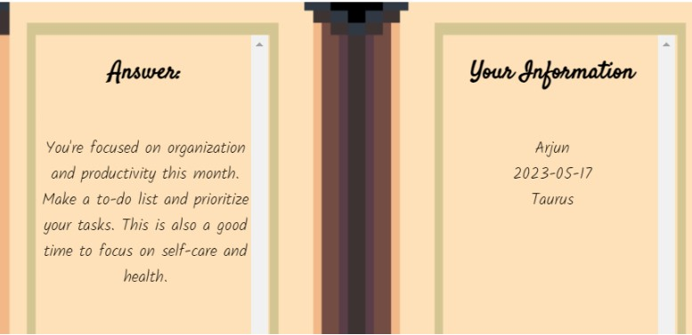
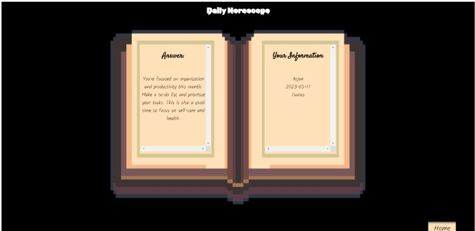
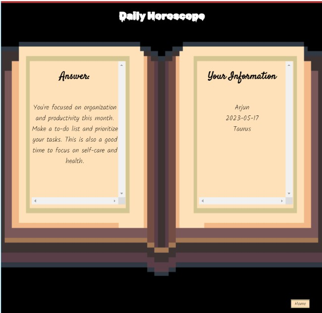

# Byte Brokers Sprint 1 ReviewMeeting
### Setting:
> 5/28/2023 2:00pm, Zoom

### Type:
Sprint Review Meeting

## Attendance:
- Arjun 
- Nikan
- Ryan
- Jennifer
- Jiapei
- Jiaxin
- Chris
- Jinshi
- Eric
## Agenda:
Review Goals for Sprint
Get progress updates from subteams
# Discussion Notes:
## Goals for this sprint:
1. General skeleton and basic functionality of app  - start with the horoscope module, want to complete the local version of module by end of sprint
   - Present options to user to pick from Tarot/Horoscope
   - For horoscope, give ability to input user data and user questions
   - For horoscope, output useful information/prediction based on user data from questionnaire
   - No goals for Tarot module yet.
2. Basic decorations with placeholder graphics
   - Create an atmosphere aligned with the Cosmic Horror theme
## What we were able to accomplish as a team(as a whole)
1. Created general skeleton - have a homepage with options to go to horoscope and tarot card modules - link to horoscope actively working
2. The user data and info is accurately obtained through the form page - have extra questions for flair/theme - need to change these to reflect theme better but they are there
3. Horoscopes are somewhat randomly assigned to make the horoscope change from day to day - user’s sign and info is accurately displayed
4. CSS for all 3 current pages are implemented based on basic images for theme - accommodates various screen sizes as css makes elements grow and shrink based on screen size.  
5. In summary: all goals have been worked on at least a little bit, most have been completed with room for improvement/iteration. 
## Progress updates from subteams:
Arjun & Ryan: 
Home Page - button to horoscope and tarot module with placeholder graphics

Decorating questionnaire, linked from home page to questionnaire

Borrowed Peter’s and Vicky’s design for output page for use in questionnaire
Created a shared stylesheet for all modules (while allowing for module-specific styles). Generally, black background, white font, etc. for creepy-ish feel
Make sure repo is setup and maintained consistently - branching and pull request management - all branches are currently up to date with prod deployment
Linting and formatting upon push
Deployed page

Jessica, Chris, Eric: 
Functionality of form page -  basic html, javascript - buttons work, take you to next page/questions

Multiple question - press buttons, next question show up
Used template format rather than form specifically to improve scalability.
Input validation tests are currently WIP.
Input validation on names is there, as well as birthdays.
The site only checks after things are input (unfocused element). Hence, you can type in something invalid. Input validation works by removing the specific illegal characters.
Feature with multiple pages of questions to accommodate small size of book/make it appear more booklike?
Alert appears when no input.

Jennifer, Nikan, Bill:

Unit testing will be Jest (installed already). Some simple test cases are already there, but mostly to test out Jest and make sure it works.
Figured out that unit testing is very difficult to use for our service, which doesn’t manipulate data very much.
Considering E2E testing, where we simulate a full user interaction flow and check the properties of each element of the app (e.g. localStorage or inspector HTML).
Doable especially after Lab 8, where we properly learn Jest and Puppeteer.
Implemented JavaScript to display Horoscope reading. Includes somewhat randomized output, so that users don’t always get the same reading. 
Initially tried giving specific traits to specific astrological signs, but were told to make it random, and it is easier to make responses totally random rather than picking from a selection based on the user’s sign?
Compiled 3 things to test on: 
After clicking questionnaire button, check if localStorage stores the right thing (information gets sent to local storage and assigned the correct keys)
After clicking back/exit button in horoscope, check if it goes back to the main page
After clicking the last continue button in questionnaire.html, check if the output page's content corresponds to the content of localStorage 

Peter & Vicky: 
Implemented images to make the Horoscope reading appear better.
Made the HTML very responsive based on user screen size. The book size will change to fit the screen.

Full screen: 

Half screen: 

Tried to not make the text shrink with user input?
If the page zooms in too much, the title starts growing, which causes it to go behind the book and get hidden.
## Action Items:
- Convert alert on no questionnaire input to something more appealing
- Find a way to completely prevent illegal characters from being typed
- Add more Jest test cases that are more useful.
- Complete E2E testing procedure.
- Make horoscope output properly align with horoscope signs, while still maintaining randomness???
- Make title not grow with screen size.
- Discuss other ways about how to website could be made to better adhere to the theme.
- Determine whether we should continue on the Tarot section.

## Next Meeting Time:
Sunday 5/28 @ 3:10pm, Zoom

End Time: 
3:00 pm
