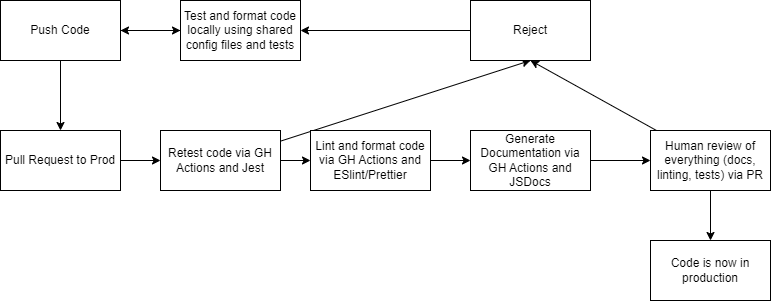

# Pipeline Status 5/21/2023

We have an initial iteration of the pipeline. The ideal pipeline is shown below:

## Current State CI/CD Pipeline
In order to be able to test our different pages/features in isolation and in integration, we have our repo set up such that we have an individual branch for each of our features/pages being developed by one of the subteams. This allows teams to test their code without affecting the programs being created/implemneted by other subteams. Then, once they are confident in their code, teams can push to their individual feature branches on the repo. Once in the repo, teams will first pull from prod to get any updated code from the other features and then create a new pull request to prod that will trigger automatic linting, code quality and unit testing via github actions. 

As it stands currently, we have a linting workflow in place that uses Prettier and ESLint (see 051623-lint ADR for more info) together to properly lint our code based on the setting we have created. We also have basic unit tests for one of our pages set up currently. We are using the Jest testing framework (see 051723-UnitTest ADR for more info) to run our JS unit tests. If all tests pass, we are able to pull request into prod. If not, the pull request will not go through and they will not be able to merge to prod. 

Once the pull request has been accepted, a new github pages will be deployed, deploying our app with its latest features. Our current pipeline is set up so that our code can be tested and checked for syntax and quality prior to it going live, and if it fails inspection, either human or automated, the new code won't go live. 

The reason that we are not using main currently (subject to change) is because there can only be one deployment per repo on github pages so we would not be able to have a private deployment via the prod branch and a live deployment via the main branch. Having only prod be live allows us to see how the changes 

- What is in the pipeline?
  - Jest for testing
  - Prettier for formatting
  - ESLint for linting
## What is in progress?

The ESLint and Prettier actions seem to occasionally be prevented from working 
due to the creation of a mysterious local change on the machine running the action. 
This local change causes a git checkout step to be prevented, which kills the entire
action. Fortunately this does not seem to happen often, but we want to figure out how 
it happesn and avoid it in the future when we can.

We also need to select a certain code standard and configure ESLint and Prettier to
match it. We may do this looking online for other well-known standards as well as 
checking our own code to see how those standards could fit in and improve it.

Finally, we are in the process of adding actual tests to our code. Before this, however, 
we want to make a little more progress on the project so that there is something to test.

## Future Plans for CI/CD
Besides human-valiated PR requests, we plan to use CodeClimate to check for code quality. 
It appears to provide tips and hints about how to improve aspects of our code (such as code coverage), 
which in the long run will improve the maintainability of our repo and reduce the risk of pushing 
buggy code.

We also plan to implement a JSDocs action in our code, upon pushing to production. The reason for this 
particular trigger is that we want the code to pass a certain standard of quality before documentation
on it is generated, as documentation suggests that the code should at least be functioning, and thus 
implies that it can be relied on by others. The advantages of generated documentation are relatively 
obvious: easy, readable information on project-related functionality. As part of the JSDocs changes, 
we have recommended to our team that a JSDoc comment generator be used.

We also want to move config files into a separate config folder. Convention suggests that config files
should be kept in the root and hidden, but sometimes it's nice to be able to check them without having
to unhide them; however, leaving them exposed may clutter the root directory. As part of the change,
we will be adding flags that tell Prettier, ESLint, Git, and other programs that depend on config files
where to check for configs. If any files MUST stay in root, we will simply leave them as-is, but 
the hope is that there will not be too many of them.

Finally, we plan to enforce that feature branches not be behind the prod branch in order to merge 
back to prod. We want to avoid the complications of merge conflicts, including bad resolutions to
them, so that we reduce the risk of the production application breaking. Exactly how this can be 
done is not yet known, but the advantages of doing so are useful enough to warrant doing it soon.