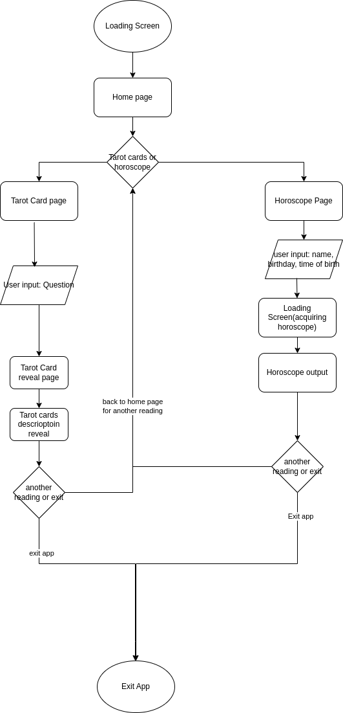

# Divination Service Pitch
Byte Brokers 5/5/2023

## Context
There are countless fortune telling and personality-categorizing experiences to be found on the internet. However, there is always a desire for new contexts under which such an experience is presented. Consider the wide variety of personality tests; while Myers-Briggs personality tests seem to be the norm, other surveys like those that cast survey subjects into certain roles in media franchises have seen significant popularity.

## User Stories
As we are making a fortune-telling app, we want to think about the people who are actually using it to predict the future. However, we also want to be aware of the fact that our product is more of an experience than anything else, since plain-old fortune telling has already been done, and in reality most people know that tarot cards and horoscopes are essentially glorified guesswork. To this end, we have developed four personas that we want to keep in mind as we work.
### Person 1: Novelty seeking
- Name: Catherine Taylor
- Age: 26
- Occupation: Bartender
- Location: Seattle, Washington
- Likes: Witty banter, Bar hopping
- Dislikes: Boredom

Description: Katie loves novelty. Although she doesn’t make a lot, she always makes sure to get the latest technology. She isn’t superstitious in general, but she is recently hooked on horoscopes. She has been using the fortune telling app she found recently and has been testing her fortune with her career and love life. She knows it can’t be real, but it is surprisingly convincing and helps her organize her wants and thoughts. She increasingly uses it more often. 

### Person 2: Finding meaning/value behind occultism via a exploring a new experience
- Name: Alex Smith
- Age: 16
- Occupation: Student
- Location: California
- Likes: Horror stories/movies, skateboarding
- Dislikes: School, fairy tales, fantasy, church

Description: Alex grew up with a mother who makes a living as a tarot card reader and is a fanatic of anything related to fortune telling (horoscopes, crystals, incense, etc). After seeing how her mother’s clients willingly believe her mother’s readings and even take action based on these readings, Alex has developed a skepticism for fortune telling and its vagueness. Thus, Alex prides herself in being a realist, but has a strong fascination with horror (realistic horror, of course). The twisted logic and pragmaticism of these horror stories appeal to her because there seems to be a system. However, all this skepticism has left her feeling aimless and purposeless in life. She tells herself that if fortune telling and divination seemed to follow some sort of logic and sense rather than making magical guesses, she would perhaps put more faith into the readings, making her drawn to our app.  

### Person 3: Actually believes in fortunes

- Name: Bethel Abraham
- Age: 25
- Occupation: Company Staff
- Location: California
- Likes: Games, Horror novels, Traveling
- Dislikes: Work Overtimes, Ominous Signs

Description: Bethel Abraham is a young man who works at a tech company in California. He works very hard and he never works overtime unless it is necessary. He likes video games, horror novels, and traveling. When there is a vacation, he goes to a new place to travel. Before he departs, he will be aware of tiny details in his life, seeking for possible ominous signs that may foresee his bad fortune in his new journey, because in some horror games and novels, there will always be some warning before something bad happens, and it is always a bad idea to ignore them. Now he is into fortune telling because he thinks it is a more professional way to figure out his future destiny in his future journey. Now he always reads his fortune from some fortune telling apps that claim to have dark power inside them.

## Problem
With the rising popularity and availability of generative AI’s on the internet, it is important to understand how they work, what they are good for, and what they can and cannot do. As we have experimented and seen, AI is not as deterministic as we thought. Its output can often be swayed by user input and preference, much like a fortune teller. As such, we have our task: create an app that provides fortune telling services to its users. Through this development process, the team should participate in proper software engineering practices and experiment with AI and its capabilities in software development. 

## Scope Variables
Our scope will be limited by a five-week time limit, student workloads (particularly during test preparation periods), and the absence of formally trained graphic and UI designers. Tasks will be prioritized based on perceived time consumption and necessity. 

## Purpose
Our team’s purpose in creating this application is twofold: to practice proper software development, engineering, and management in a low risk environment and explore what avenues of software and program development AI can assist us in. As students at UCSD, we have been exposed to several different programming languages, techniques and theories surrounding computational engineering and programming. However, most of us have had little to no experience working on programs as teams do in the industry. While our code is often untouched once we submit it, in industry, code is iteratively developed and improved past the initial submission of the code. Our main goal during this development process is to get a feel of how to iteratively create and improve a code base and application and experience working in a larger team and managing constraints and expectations. We also have the additional element of dealing with AI. With ChatGPT’s rising prevalence in our world, it is crucial that we, as computer scientists and engineers, get a proper feel for how it can aid and hurt us. Exploring this tool is a focal point of this project as well. 

## Solution
“Knowledge beyond Human Comprehension.”

We propose a fortune telling service presented over a cosmic horror theme, which construes the premonitions as otherworldly knowledge. When users visit the link, our service will present up to two options for fortune telling and a prompt to select one. Our main two features of focus during this ~6 week development period are horoscopes and Tarot Card readings. 

### Feature Development Progression
- The horoscope reading feature will be developed first. A button to access this feature will be on the left of the first page.
- There are 2 main pages associated with this feature: first the page to collect user information to make the horoscope accurate (name, gender, birthday, time of birth, etc.).
- Second, the page that explains the user’s horoscope for the day. It is possible that there will be an interactive ritual component for revealing the horoscope; it could even be timed, as though one could only withstand looking at forbidden knowledge for so long.
- The tarot card feature will be developed if/when the horoscope feature is completed. A button to access this feature will be on the right of the first page.
- There will be a series of pages associated with this feature: a page relating to some questions the user will have to answer before viewing the Tarot Cards (such as what domain they want advice in: 
- A page that shows 3 cards to the user with an interactive component:
- Finally, a screen displaying the explanation of said cards. 

### Graphics Progression
- Graphics will start out as placeholders; these may simply be placeholder images or free online assets that align with the aesthetic we are pursuing. No background will be used. We will allow these placeholders to end up in the final product if time constraints prevent further progress in this respect.
- Background and Title screen images/graphics will be developed as actual app functionality becomes more solidified and consistent. 
- Graphics could potentially evolve into one of two options: 
    - Vector-based graphics. 
    - AI-generated graphics based on iteratively feeding prompts to obtain intended output. 

### Prototypes and Current Plans
*Initial Fat Marker Sketch*

*Wireframe from Fat Marker Sketch*
[Initial Wireframe(Figma.com)](https://www.figma.com/file/vYLvMTtpc2HdsDHxwKjxnM/Divination-app?node-id=0%3A1&t=4RyrcUnawoLvHOEY-1)

*User interaction system flow*

*C4 System Diagram*
For brevity we have omitted the Context and Containers diagrams, both of which would only consist of the users who interact with the website, and the website which passes future predictions and advice back to the user. The Components Diagram is below:

*Prototype*
[Divination app (figma.com)](https://www.figma.com/proto/vYLvMTtpc2HdsDHxwKjxnM/Divination-app?node-id=14-5&scaling=min-zoom&page-id=0%3A1&starting-point-node-id=1%3A2&show-proto-sidebar=1)

## Risk and Rabbit Hole Management
### Questions to ask: 
- Does this require new technical work we’ve never done before?
- Are we making assumptions about how the parts fit together?
- Are we assuming a design solution exists that we couldn’t come up with ourselves?
- Is there a hard decision we should settle in advance so it doesn’t trip up the team?

### What are some of the obvious risks in this project?

- Putting too much on ourselves: unlike people in industry or even those who wrote ShapeUp have had planning experience. They know what they can and can’t do in the time allotted. Now, we too have 6 weeks roughly to complete our project. Is having a tarot card feature and a horoscope feature too much? Of note is that we already have user interface documentation that assumes that both will be completed, making the expectation that we have to implement both fortune telling techniques significantly harder to break.
- Time commitments of team members/how to we break up work?: While our team is quite large, we are full time students, not engineers. So we have to be careful in making sure we have enough people on development, testing and ensuring that it all gets documented properly. What happens if communication breaks down? Midterms/finals may exacerbate this issue.
- How fleshed out is the Tarot card idea: While we all agreed with the idea of Tarot cards as one of our two forms of fortune telling, how viable is it for us to create such a feature. Especially without graphic design or artists on our team, how fast can we expect it to take for AI to generate unique images for us to use

### Rabbit holes:

- Focusing on Tarot cards: we have agreed on the idea that we want 4 categories of cards. However, there is a version where we can use questions from the user to decide which set of cards to display to them. Based on the initial black marker diagram - ask multiple choice questions(good idea) then show 3 cards, after user clicks on each card, short description shows for their meaning. Is this what we want?
- Can a user get multiple tarot readings a day? - should we even consider this/should we mark it as out of bounds for the sake of time?
- If we’re not storing data about the user, we may not even be able to record information about when a user got their reading. 
- Horoscope: while simple enough, and we know what info we need - gender, name, birthday etc., how are we to get the accurate horoscope for the day? 
- If we get to the point where we can use APIs, some exist that could help us with this, but what if the API goes down?
- A quick search suggests that horoscopes are based on the position of the moon relative to other planets, which is impossible for us to incorporate into our app without APIs.
- Creating user log in: this would require backend experience, to create a table that stores users information - should we cut back on this part/don’t look into it too much simply because learning the backend to create this would take too long?
- We’ve discussed that we have 6 main screens: title screen, home page, horoscope info page, horoscope result page, tarot question page, tarot result page. Depending on how many questions we ask in the tarot card reading, do we add more pages or do we simply change the question on the page and update the reading? Similar to above issue, how many questions do we need?
- Current aesthetic theme is Cosmic Horror (Shop?). There is a high possibility that achieving this will be time-consuming given the absence of digital art experience on our team. 

**Patches/putting things OB/Cut back**
To manage time spent on aesthetic, perhaps make progress tiered: free placeholder assets first, then small custom-made graphics with white background, then add a basic background, then more decorations etc. Make finding free placeholders high priority and everything else only an optional task after the tarot card functionality (with placeholders) is done.
To account for the possibility that doing both tarot cards and horoscopes may be difficult, perhaps slightly modify the design initially such that it displays only one service. For example, we can make the prompt 2/3rds of the screen, and the horoscope ⅓, allowing for the ⅔ part of the screen to be divided once more when we add the tarot cards. This should be very similar to the current prototype and can be adapted for two services whenever necessary.
Due to the difficulty of getting a daily horoscope, we may have to limit ourselves to just doing general descriptions of each sun sign. Figuring out horoscopes will only be possible after getting the ability to use APIs and even then should be low-priority.
Perhaps do fictional horoscopes? Considering that normal horoscopes are already done, and we’re really crafting an experience rather than actually fortelling futures, this may be a more viable option on top of being more interesting.
Possibly load up on work in weeks 7-9, and let up on weeks 5-6 and 10 to allow people to prioritize testing.
**No-Go’s**
There are several places where our app can become quite diverse and advanced, but to keep ourselves focused and avoid looking too far ahead there are a couple features that, while enticing, we are going to say no to for now. 

*User Login:*
This feature would be immensely helpful for users so they don’t have to keep logging in every time they would like to view their horoscope or have a new Tarot card reading. There are several features that could be built on top of this, including viewing past Tarot Card readings as well as your horoscope doesn’t have to be fetched again every time you enter the app. However, while a common feature, would require a fair amount of backend implementation. With our limited time, we want to focus on our main functionality and front end, so anything beyond saving the user’s name and information (if they choose horoscope) during their session on our app should be out of the question for now. 

*Change number of Tarot Cards displayed + allowing only a single reading a day:*
Our initial idea was to show 3 Tarot cards to the player once they have answered our questions for the Tarot card reading. However, a Tarot Card reading can take on many different forms, from the questions asked to the number of cards shown. We already have the feature of having the player choose a different set of cards based on what topic they want their reading to be on (job, personal life, relationship, etc), so adding the ability to change how many cards a player can select could be difficult to fit into our time constraint, especially with the time it will take to implement the basic Tarot Card feature. So this idea will be put out-of-bounds. Additionally, people usually get a single Tarot Card reading a day. Limiting the user to only 1 reading a day would again take a fair amount of backend knowledge to implement and would stem from the previous No-Go feature of holding user login info. For this reason, we are ok with letting users get multiple readings a day (but not per session on the app). 
